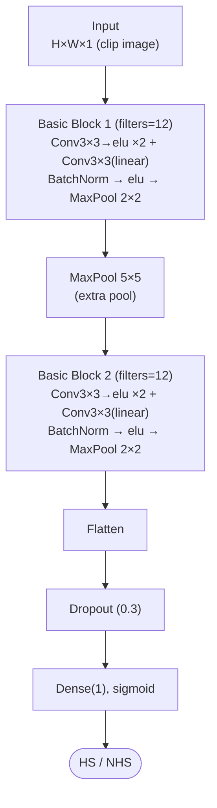
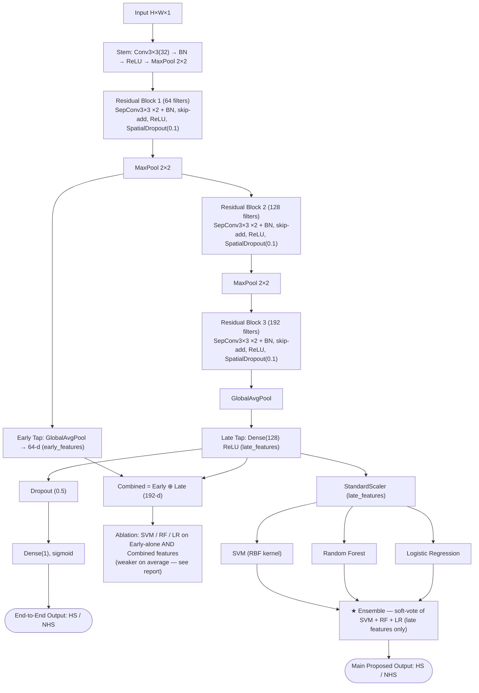

# CNN Deep Features with Classical Machine Learning Classifiers for Lithography Hotspot Detection


---

## Overview

This repository contains the full pipeline, results, and report for *"CNN Deep Features with Classical Machine Learning Classifiers."*

**Research Question:** Can features learned by a CNN, subsequently classified using classical machine-learning models (SVM, Random Forest, Logistic Regression), outperform a direct end-to-end classification strategy for lithography hotspot detection on the ICCAD-12 benchmark suite?

We train a residual, depthwise-separable CNN from scratch on each of the five ICCAD-12 benchmarks, tap its activations at two depths (**early** and **late**, plus their **concatenation**), and classify the resulting feature vectors using SVM, Random Forest, and Logistic Regression. All results are compared against a faithful reimplementation of the reference paper's lightweight CNN baseline, evaluated under identical experimental conditions.

## Repository Structure

```
.
├── Features_Full_Pipeline.ipynb  
├── results/
│   ├── results_full.csv         
│   ├── precision_by_benchmark.csv
│   ├── recall_by_benchmark.csv
│   ├── specificity_by_benchmark.csv
│   ├── f1_by_benchmark.csv
│   ├── balanced_accuracy_by_benchmark.csv
│   └── timing_and_dims.csv     
├── figures/
│   ├── proposed_architecture.png    # Flowchart: residual backbone + classical classifiers
│   ├── baseline_architecture.png    # Flowchart: reference baseline CNN
│   ├── class_distribution.png       # HS/NHS imbalance per benchmark (log scale)
│   ├── balanced_accuracy_comparison.png
│   ├── confusion_matrices.png       # Row-normalized, 5 methods x 5 benchmarks
│   └── all_metrics_comparison.png
└── README.md
```

## Dataset

**ICCAD-12 Benchmark Suite** — 5 independent benchmarks, binary classification (Hotspot vs. Non-Hotspot), each with an official train/test split.

| Benchmark | Train HS | Train NHS | Test HS | Test NHS | Train Imbalance Ratio |
|---|---:|---:|---:|---:|---:|
| ICCAD-1 | 99 | 340 | 226 | 4,679 | ~1:3.4 |
| ICCAD-2 | 174 | 5,285 | 498 | 41,298 | ~1:30 |
| ICCAD-3 | 909 | 4,643 | 1,808 | 46,333 | ~1:5.1 |
| ICCAD-4 | 95 | 4,452 | 177 | 31,890 | ~1:47 |
| ICCAD-5 | 26 | 2,716 | 41 | 19,327 | ~1:104 |

All five benchmarks are highly imbalanced, and per the assignment's requirement, **each is evaluated separately** — never merged for primary experiments.

## Architecture

### Reference Baseline CNN



Faithful reimplementation of the reference paper's lightweight CNN (Fig. 6/7, Table I). Optimizer: **Nadam**, loss: **Focal Loss (γ=2.0, α=0.75)** — same imbalance-aware loss used throughout this study, so every model in the comparison is trained under the same imbalance-handling strategy and only the loss's effect on architecture-vs-representation differences is being measured. Threshold tuned on the validation split. **6,949 parameters.** Trained end-to-end only and never used for feature extraction — it exists purely as the fixed point of comparison, per the assignment's "common baseline" requirement.

See `figures/baseline_architecture.png` for the full annotated diagram.

### Proposed Architecture



Backbone: residual, depthwise-separable CNN (3 residual blocks: 64 → 128 → 192 filters, L2-regularized), trained end-to-end **and** reused as a feature extractor. Optimizer: **Adam**, loss: **Focal Loss (γ=2.0, α=0.75)**. **163,489 parameters.** `early` = post-Res-Block-1 GAP (64-d), `late` = pre-head Dense (128-d), `combined` = early⊕late (192-d). The headline classical result is the **Ensemble on late features** (0.894 avg. balanced accuracy) — early and combined features are ablations only, and are never merged into the ensemble path.

See `figures/proposed_architecture.png` for the full annotated diagram.

## Methodology

### 1. Reference Baseline (fixed, external)
A faithful reimplementation of the reference paper's lightweight CNN (Fig. 6/7, Table I): two stacked basic blocks (3× `Conv2D(12, 3×3)` → BatchNorm → elu → MaxPool), separated by an extra 5×5 max-pool, followed by Flatten → Dropout(0.3) → sigmoid. Trained with Nadam and Focal Loss (γ=2.0, α=0.75) — the same loss used for the proposed model, so the comparison isolates architecture/representation differences rather than differences in how class imbalance is handled. **6,949 parameters.** This model is trained end-to-end only and never used for feature extraction — it exists purely as the fixed point of comparison, per the assignment's "common baseline" requirement.

### 2. Proposed Backbone
A residual CNN with depthwise-separable convolutions (3 residual blocks: 64 → 128 → 192 filters, L2-regularized, with `SpatialDropout2D`), trained end-to-end with **focal loss** (γ=2.0, α=0.75) to address class imbalance directly in the loss function. **163,489 parameters.**

- **Early tap:** Global-average-pooled activations after residual block 1 (64-dim)
- **Late tap:** Dense layer immediately before the classification head (128-dim)
- **Combined:** Concatenation of early + late (192-dim)

### 3. Classical Classifiers
Each feature set (early / late / combined) is standardized (`StandardScaler`) and classified using:
- **SVM** (RBF kernel, class-balanced, small `C ∈ {0.5, 1.0, 5.0}` search on validation)
- **Random Forest** (300 trees, class-balanced)
- **Logistic Regression** (class-balanced)
- **Ensemble**: soft-voting average of SVM + RF + LR on late features (validation-fit min-max normalization, no test-set leakage)

### 4. Decision Thresholds
Every model's classification threshold (CNNs, SVM, RF, LR, ensemble) is tuned by maximizing **balanced accuracy on the validation split** — never on the test set — before final test-set evaluation. This keeps the comparison across all 12 methods fair and consistent.

### 5. Experimental Protocol
For each benchmark independently: official training set → stratified 85/15 train/validation split → models trained/tuned on train+validation → final metrics computed on the official, untouched test set.

## Setup & Installation

```bash
pip install gdown scikit-learn tensorflow pandas matplotlib
```

Requires a GPU-enabled environment (Kaggle / Colab recommended) — CNN training is impractical on CPU alone for this dataset size.

## Usage

1. Open `Features_Full_Pipeline.ipynb` in Kaggle or Colab.
2. Enable GPU (Settings → Accelerator → GPU) and Internet access.
3. Run all cells top to bottom. The pipeline:
   - Downloads and extracts the ICCAD-12 dataset
   - Trains the reference baseline + proposed backbone per benchmark
   - Extracts early/late/combined features and trains SVM/RF/LR/Ensemble
   - Checkpoints results after every benchmark (`/kaggle/working/checkpoints/`) so a disconnect never costs more than the current benchmark
   - Saves all metrics, tables, and figures automatically

Approximate runtime: ~40–60 minutes on a T4/P100 GPU.

## Results Summary

**Average Balanced Accuracy across all 5 benchmarks:**

| Method | Avg. Balanced Accuracy |
|---|---:|
| Reference Baseline CNN (end-to-end) | 0.920 |
| **Ensemble (SVM+RF+LR, late features)** | **0.894** |
| Random Forest (late features) | 0.888 |
| Logistic Regression (combined features) | 0.873 |
| Random Forest (combined features) | 0.870 |
| Logistic Regression (late features) | 0.857 |
| SVM (combined features) | 0.856 |
| SVM (late features) | 0.848 |
| Proposed CNN (end-to-end) | 0.843 |
| Logistic Regression (early features) | 0.747 |
| SVM (early features) | 0.725 |
| Random Forest (early features) | 0.668 |

**Key finding:** the reference baseline is a strong, hard-to-beat performer on average — but on **ICCAD-5** (the smallest, most severely imbalanced benchmark, 1:104 ratio), classical classifiers on extracted late features detect hotspots far more reliably than either end-to-end CNN (e.g., Random Forest on late features: **97.6% hotspot recall** vs. the reference baseline's 75.6%). See the full report for the complete per-benchmark breakdown and discussion.

## Ablation Study

Early vs. late feature depth (see `figures/all_metrics_comparison.png`): late-layer features consistently outperform early-layer features across every classifier (LR: 0.857 vs. 0.747; RF: 0.888 vs. 0.668; SVM: 0.848 vs. 0.725 average balanced accuracy), supporting the hypothesis that deeper, task-specific representations transfer more effectively to classical classifiers than coarse early-layer features.

## Limitations & Future Work

- Decision Tree was not evaluated as a fifth classifier (SVM, RF, and LR were prioritized); a natural extension.
- Run-to-run variance was observed on the smallest benchmarks (ICCAD-1, ICCAD-4, ICCAD-5) due to non-deterministic GPU operations and unseeded augmentation — reporting mean ± std over multiple seeds would strengthen confidence in these specific results.
- Cross-benchmark generalization (train on one benchmark, test on another) was outside this study's scope.

## References

1. A. Verma, K. A. Rao, and D. S. Hegde, “Lithography Hotspot Detection using Deep Learning,” IIT Bombay (reference paper for this assignment).
2. V. Borisov and J. Scheible, “Lithography Hotspots Detection Using Deep Learning,” SMACD 2018, pp. 145–148, doi: 10.1109/SMACD.2018.8434561.
3. H. Yang, Y. Lin, B. Yu, and E. F. Y. Young, “Lithography Hotspot Detection: From Shallow to Deep Learning,” SOCC 2017, pp. 233–238, doi: 10.1109/SOCC.2017.8226047.
4. Y.-T. Yu, G.-H. Lin, I. H.-R. Jiang, and C. Chiang, “Machine-Learning-Based Hotspot Detection Using Topological Classification and Critical Feature Extraction,” IEEE Trans. Computer-Aided Design of Integrated Circuits and Systems, 2015.
5. J.-R. Gao, B. Yu, and D. Z. Pan, “Accurate Lithography Hotspot Detection Based on PCA-SVM Classifier with Hierarchical Data Clustering,” Proc. SPIE, 2014.
6. L. Liao, S. Li, Y. Che, W. Shi, and X. Wang, “Lithography Hotspot Detection Method Based on Transfer Learning Using Pre-Trained Deep Convolutional Neural Network,” Applied Sciences, vol. 12, 2192, 2022, doi: 10.3390/app12042192.
7. S. Dieleman, K. W. Willett, and J. Dambre, “Rotation-invariant convolutional neural networks for galaxy morphology prediction,” arXiv:1507.02313, 2015.
8. K. He, X. Zhang, S. Ren, and J. Sun, “Deep Residual Learning for Image Recognition,” in Proc. IEEE Conference on Computer Vision and Pattern Recognition (CVPR), 2016, pp. 770–778.
9. A. G. Howard et al., “MobileNets: Efficient Convolutional Neural Networks for Mobile Vision Applications,” arXiv:1704.04861, 2017.

